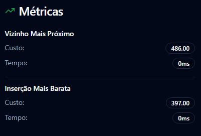

# Requisitos de Compilação
* `g++` versão **C++17** ou superior
* `Node.js` versão **16.0.0** ou superior
* `npm` versão **8.0.0** ou superior

---

# Baixar Resultados

Os resultados dos processamentos podem ser baixados em formato PDF, contendo uma tabela com os seguintes dados:

- Nome do arquivo processado
- Algoritmo utilizado
- Custo total da solução
- Tempo de execução (ms)
- Valor ótimo (se disponível)
- Gap percentual em relação ao valor ótimo (se disponível)

**Passos para baixar os resultados:**
1. Acesse o menu inicial da aplicação.
2. Clique no botão **"Baixar Resultados"**.
3. O PDF será gerado e aberto em uma nova aba do navegador.

Também pode ser visualizado o relatório do processamento entregue na apresentação do projeto: [Relatório de Processamento (PDF)](./TabelaAPA.pdf)

---

# Funcionamento da Aplicação

## 1. Entrada de Dados


- Insira um arquivo `.txt` no formato válido.
  - Exemplo: 
- Configure os parâmetros de perturbação para o algoritmo ILS (ou use os valores padrão).
- Clique em **"Definir Parâmetros"** e abra a aba de **Processamento**.
- Consulte informações sobre o projeto e a equipe na seção **"Sobre o Projeto"**.

---

## 2. Processamento


- Escolha o algoritmo desejado para traçar as rotas.
- Aguarde o processamento.
- Analise as métricas obtidas:
  - Exemplo: 
- Verifique o ranking dos resultados:
  - Exemplo: 
- Os resultados são armazenados no back-end e podem ser baixados na tela inicial.

---

## 3. Algoritmos Disponíveis


Descrição dos algoritmos implementados:

- **Vizinho Mais Próximo (Guloso)**
- **Inserção Mais Barata (Guloso)**
- **VND (Variable Neighborhood Descent)**
- **ILS (Iterated Local Search)**

---

## 4. Baixar Resultados


- Na tela inicial, clique em **"Baixar Resultados"** para gerar o PDF.
- O relatório inclui uma tabela organizada com as métricas de cada algoritmo aplicado aos arquivos processados.

---

## 5. Como Executar o Código

**Back-end:**
```cmd
cd ./backend/
g++ server.cpp -o server
./server
```

**Front-end:**
```cmd
cd ./frontend/
npm install
npm run dev
```

**Execução de Testes**
1. Altere as constantes `nome_arquivo`, `valor_otimo` e `iteracoes_teste` no arquivo `backend/main.cpp`, então execute no terminal:
```
cd ./backend
g++ main.cpp -o exec
./exec
```

---

# Equipe
- Luis Gustavo Lacerda Reis
- Herick José de Freitas
- Josué Guedes Ferreira

# Conclusão
Embora os resultados obtidos não sejam necessariamente os ótimos, o trabalho proporcionou grande aprendizado na área de otimização. O projeto estimulou a criatividade na implementação e análise de algoritmos gulosos e de vizinhança. <br>
Agradecemos ao Prof. Bruno Petrato Bruck pelo acompanhamento e pelas orientações durante o desenvolvimento do projeto.

